# CrossTrinity
Un add-on Godot pour constituer un moteur data-driven pour des jeux d'actions et/ou d'expérimentation combinatoire basée sur l'approche de composition.

## Arborescence

res://
 - **addons/**
 - **autoload/** 
      - [ ] `game_database.gd`
      - [ ] `debug_console.gd`
      - [ ] `event_bus.gd`
      - [ ] `timeline_system.gd`
      - [ ] `interaction_engine.gd`
      - [ ] `conflict_mediator.gd`

- **core/**
  	- **value_objects/**
      - [ ] `conflict_batch.gd`
      - [ ] `reaction_context.gd`
      - [ ] `tag_registry.gd`
    - [ ] `rule_resolver.gd`
    - [ ] `conflict_resolver.gd`
    - [ ] `tag_query.gd`
    - [ ] `event_heap.gd`
    - [ ] `effect_applier.gd`
    - [ ] `event_consumer.gd`
- **data/**
  - **conflicts/**
      - [ ] `conflict_profile.gd`
  - **events/**
      - [ ] `event_data.gd`
  - **rules/**
      - [ ] `rule_data.gd`
  - **tags/**
      - [ ] `tag_data.gd`

- scenes/
  - main/
  - ui/
  - debug/
- ui/
  - widgets/
  - panels/
  - overlays/
- tools/
  - editors/
  - generators/
  - importers/
  - validators/
  - tests/
- [x] README.md

## Origine du projet

  Au départ pensé comme un simple add-on, utilisant innocemment les approches programmatives telles que l'héritage et la composition, pour bricoler un petit moteur de jeu d'action… Ce projet a maturé vers une approche plus axée vers la composition, notamment par lassitude de devoir recoder tout le moteur pour chaque ajout et/ou modification ou presque.

  Fort de ce constat, ce projet a été repensé en cherchant une philosophie différente mais surtout plus proche des mécaniques nucléaires du genre des jeux d'actions avec un soupçon (une petite louche à chaudron) d'expérimentation combinatoire.

  C'est ainsi que le projet a été repensé en partant dans le sens inverse: plutôt que d'intégrer les éléments au moteur au besoin, chercher les besoins auquel fournir des éléments à intégrer au moteur. Cette démarche demande conséquemment un point très particulier: le noyau du moteur DOIT rester inchangé peu importe les besoins futurs. 

## Objectifs
  Cette démarche oblige alors à définir les attentes les plus simples que le noyau doit remplir, peu importe la nature de la tâche demandée. C'est pourquoi il a fallu mieux définir ce qu'étaient les objectifs du projet d'add-on: `action`, `expérimentation`, `combinaison`. 

### Action

  L'action dans un jeu est représentée dans sa forme la plus simple par un `input` ou `évènement d'entrée`. Structurellement parlant, tous les jeux sont des jeux d'action (phrase bateau #9201830…). Mais un jeu d'action est défini par comment l'input produit ce que le joueur voit et ressent comme une action: pour le joueur, une sélection dans un menu n'est pas une action mais bouger son personnage ou interagir avec un objet en jeu l'est. De facto, le genre `action` englobe pléthores de catégories différentes: 
  + `combat`;
  + `rythme`;
  + `rpg`;
  + `fps`;
  + `rts`;
  + `moba`;
  + `point_and_click`;
  + etc.

Toutefois, dans ces catégories, il existe des requis simples qui sont attendus d'un moteur: recueillir un `input`, le diriger au bon `canal de diffusion`, consommer l'input diffusé dans le bon `système` et générer un `résultat` selon le système.

Suivant la `catégorie`, l'input aura différentes façons d'être consommé. Cependant, il faut ajouter à ceci qu'un input peut, dans certaines catégories, entrer en conflit avec d'autres inputs courants. Dans d'autres, l'input peut aussi interagir avec d'autres inputs pour changer son résultat après traitement et résolution.

### Expérimentation

  Quand on parle d'expérimentation, la notion d'émergence n'est jamais très loin. Car cette dernière est souvent source de la première. Néanmoins, le rapport avec un moteur reste flou, sauf si on veut rajouter une notion d'évolutivité.
L'idée clé à retenir est : plutôt que de brider le noyau du moteur, mieux vaut brider les systèmes. Ce qui conclut à justifier les responsabilités du noyau ainsi que des systèmes. (Tiens, tiens… comme par hasard, la composition s'y porte bien.) 
  Cette idée en gameplay donnerait : plus brider les options du joueur pour favoriser sa recherche de connaissance. Sympathique, mais même pour un jeu court, des options limitées confortent rarement le joueur à l'expérimentation sans possibilité d'émergence. Or, même avec des options limitées, il existe une approche facile pour favoriser l'émergence.

### Combinaison

  Suivant la philosophie de conception, un moteur peut intégrer plusieurs systèmes différents avec en eux-mêmes des gestions différentes des inputs. Or, pour un noyau de moteur quasi immuable, l'important est l'unicité de la logique la plus basique: tous les systèmes doivent avoir la même logique ou traiter les inputs suivant un même langage. Pour assurer cette contrainte, il faut hypothétiser une anomalie, un bug cohérent: si tous les systèmes étaient combinés, comment faire pour ne pas faire exploser la taille du code ? 
Réponse: pour chaque fonction du système combiné, chaque système peut avoir une part de code commune avec les autres.
En d'autres termes: en supprimant le plus de spécificité possible, tous les systèmes n'en sont qu'un seul, in fine. Ce qui implique que si deux systèmes ont quasiment les mêmes fonctions, ils peuvent être combinés en un seul.

  Cette façon de penser peut aussi s'appliquer aux inputs: plutôt que d'avoir plusieurs types d'inputs différents, autant avoir un input très général qui sera traité plus spécifiquement par le système adéquat.
Cette logique basé sur la combinaison peut s'appliquer aux objets du jeu suivant le besoin:
- combos;
- craft;
- qte;
- réactions / interactions;
- synergies;
- etc.

### Universalité
  L'add-on dans sa conception présente donc plusieurs contraintes:
  * noyau de moteur (quasi) immuable;
  * modèle de système de gestion / résolution unique et déclinable;
  * input générique compatible avec tous les systèmes sans exception;
  * possibilité de gestion d'un même input par plusieurs systèmes;
  * moteur composable;

  C'est pourquoi, afin de pouvoir de répondre à ces contraintes, il a fallu pensé ***à l'envers***. Communément pour une boucle de gameplay, on pense d'abord aux inputs puis on construit le système qui s'adapte le plus approximativement au gameplay voulu. Ici, il fallait d'abord penser au système, réviser sa logique, ses responsabilités; pour ensuite définir la forme que l'input attendu doit prendre pour être consommé. 

Cette logique confirme l'hypothèse de la généricité de l'input, dorénavant nommé 'action' pour ne pas confondre avec l'input système (bouton, joystick, touché tactile, etc.). Chaque `input` produit une `action` générique qui peut être consommée par tous les systèmes de gestion / résolveurs. Mais une action seule ne devrait contenir toutes les informations nécessaires à sa consommation. 
Une action devrait, sinon, le cas échéant:
* contenir ses informations;
* `médier` et `résoudre` tout `conflit` dépendant d'actions à collecter dans un intervalle donné;
* contenir les informations de son propre `contexte`;
* coupler les actions avec lesquelles elle peut rentrer en `interaction`;
* rapporter les `règles` nécessaires pour résoudre lesdits conflits d'`effets` à appliquer avec les `résolveurs`;
* contenir les informations des `évènements` issus de sa consommation par les `systèmes`.

## Pipeline

On obtient alors par ce raisonnement le pipeline suivant afin de ne pas surcharger l'action :

```mermaid
flowchart TD 

ACT["<b>Action</b> 
déclenche une interaction"] 

EB["<b>EventBus</b> 
signaux globaux"] 

IE["<b>InteractionEngine</b> 
compile tous les tags
présents dans la base de données
concernant l'interaction liée à l'action"]

RC["<b>RéactionContext</b> 
compile / contextualise
les tags, id et valeurs à évaluer pour l'interaction"] 

RR["<b>RuleResolver</b> 
vérifie la compatibilité des règles
avec les tags, ids et valeurs présents dans le contexte"] 

CM["<b>ConflictMediator</b> 
crée, stocke et actualise les batchs,
les associe à une catégorie et un canal de transmission  
category:channel → resolver"] 

CB["<b>ConflictBatch</b>
initialise un intervalle de conflit en phases:
OPEN → GRACE → LOCKED → RESOLVED, 
collecte les inputs temporaires, 
appelle le resolver"]

CR["<b>ConflictResolver</b>
résout le conflit pour générer
le ou les interactions liés à l'action de base"]

EA["<b>EffectApplier</b> 
crée les événements issus des règles applicables"] 

TS["<b>TimelineSystem</b> 
file des événements différés 
execute_at / priority / sequence "] 

OUT["<b>Systèmes finaux</b>
Combat / Status / Craft 
UI / Audio / FX / Stats"] 

ACT -->|"déclenche"| EB 

EB -->|"émet / écoute directement"| IE
EB -->|"émet / écoute en différé"| CM

CM -->|"crée"| CB 
CB -->|"collecte / évalue des actions concurrentes"| CR
CR -->|"résultat(s)"| IE

IE -->|"crée"| RC 

RC -->|"contextualise"| RR 
RR -->|"compile et résout les conflits de règles à appliquer"| EA 
EA -->|"crée / planifie les événements"| TS 
TS -->|"dispatch"| OUT 
classDef action fill:#7c3aed,color:#fff,stroke:#a78bfa,stroke-width:3px 
classDef core fill:#1e293b,color:#fff,stroke:#64748b,stroke-width:2px
classDef conflict fill:#777777,color:#fff,stroke:#ffffff,stroke-width:3px
classDef context fill:#312e81,color:#fff,stroke:#818cf8,stroke-width:2px 
classDef resolver fill:#14532d,color:#fff,stroke:#4ade80,stroke-width:2px 
classDef timeline fill:#7c2d12,color:#fff,stroke:#fb923c,stroke-width:2px 
classDef output fill:#334155,color:#fff,stroke:#94a3b8,stroke-width:2px 
class ACT action; 
class EB,IE core;
class CM,CB,CR conflict;
class RC context; 
class RR,EA resolver;
class TS timeline;
class OUT output;
```

 Ce pipeline a pour avantage de pouvoir gérer deux types d'action généraux: celui des actions dont les effets doivent être directs et celui de celles dont les effets dépendent d'actions réponses à collecter temporairement et doivent par conséquent être différés. Cette séparation permet à ces actions d'être traitées de manière équivoque par le reste du pipeline à partir de l'InteractionEngine et décomplexifie l'architecture nécessaire au moteur pour gérer la majorité des catégories d'action.  

## Architecture

### EventBus

Autoload de signaux globaux.

Rôle :
- Centraliser les signaux transversaux,
- Éviter le couplage direct entre nodes éloignés,
- Emettre des signaux directs,
- Emettre des requête de signaux différés,
- Rester sans logique métier.

### ConflictMediator

Autoload, Orchestrateur des conflits.

Rôle :
- Créer et actualiser les batches suivant les signaux différés.
- Choisir et attribuer au batch son resolver selon `category:channel`.
- Transmettre le résultat final à l'InteractionEngine.

### ConflictBatch

Objet temporaire de décision.

Rôle :
- Recevoir les inputs pendant une fenêtre courte,
- Evaluer les inputs et les classer par cible,
- Passer par les phases `OPEN`, `GRACE`, `LOCKED`;
- Produire un résultat via un resolver.

### ConflictProfile

Resource, Object initial de décision.

Rôle :
- Fixer les durées de phase `OPEN` et `GRACE` du batch,
- Fixer les seuils d'évaluation d'action réponse du batch selon la durée de phase `OPEN`.

### ConflictResolver

Objet temporaire de décision.

Rôle :
- Evaluer les inputs pour chaque cible de batch selon l'appréciation du système `category:channel`,
- Sélectionner les meilleurs inputs retenus pour chaque cible,
- Générer un résultat pour chaque cible selon l'appréciation du système `category:channel`,
- Produire le résultat final du batch.

### InteractionEngine

Autoload de logique transversale.

Rôle :
- Recueillir les tags et ids assignés aux signaux reçus,
- Génèrer un contexte de réaction composé des tags, valeurs et ids collectés.

### ReactionContext

Objet temporaire de décision.

Rôle :
- Compiler les tags et ids suivant la source, la cible et l'environnement de l'action,
- Compiler les valeurs à évaluer selon l'interaction,

### RuleResolver

Objet temporaire de décision.

Rôle :
- Compiler les règles associées aux tags et idées transmis par le contexte,
- Sélectionner les règles applicables,
- Produire un registre de règles applicables.

### RuleData

Ressource de décision.

Rôle :
- Compiler les tags, ids sélectionnés pouvant valider ou non son application dans un contexte,
- Rassembler des effets et leurs conditions à remplir.

### EffectApplier

Objet temporaire de décision.

Rôle :
- Appliquer les règles sélectionnées au contexte,
- Générer des évènements à programmer à partir des applications.

### EventData

Ressource d'évènements.

Rôle :
- Compiler les données de l'effet et ses tags et ses ids associés,
- Garde ses temps de mis en file d'attente, d'exécution, son type. 

### TimelineSystem

Autoload, File d’exécution des événements.

Rôle :
- Stocker les événements déjà résolus,
- Les trier par `execute_at`,
- Les distribuer aux consommateurs.

### EventConsumer

Objet de d'exécution.

Rôle:
- Consommer les évènements du (des) type(s) qu'il gère,
- Gérer et appliquer les évènements déployés.

Avec cette architecture, seuls les `résolveurs de conflits` et les systèmes finaux ou `consommateur d'évènement` sont à décliner suivant leurs classes de base pour implémenter les types d'évènements souhaités. Ces derniers doivent être renseignés au préalable dans les types de l'`EventData`. 
Les tags et les ids servent ici des contextualisateurs globaux pour les tags (contenant leurs propres relations entre eux) et locaux pour les id.
