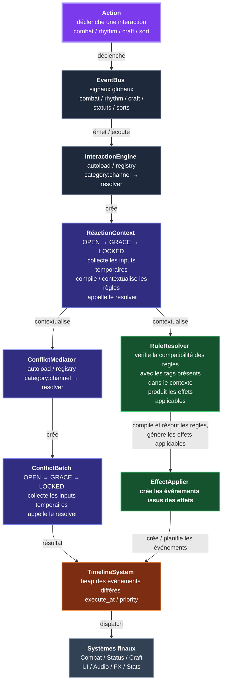

# CrossTrinity
Un add-on Godot pour constituer un moteur data-driven pour des jeux d'actions et/ou d'expérimentation combinatoire basée sur l'approche de composition.

## Arborescence

res://
 - addons/
 - autoload/
  - [] game_database.gd
  - [] debug_console.gd
  - [] event_bus.gd
  - [] timeline.gd
  - [] interaction_engine.gd
  - [] conflict_mediator.gd
  - [] save_manager.gd

- core/ 
  - value_objects/
      - [] conflict_batch.gd
      - [] stat_block.gd
      - [] reaction_context.gd
      - [] tag_registry.gd
      - [] rule_resolver.gd
      - [] tag_query.gd
      - [] event_types.gd
      - [] effect_applier.gd
      - [] event_consumer.gd

- data/
  - tags/
      - [] tag_data.gd
  - elements/
      - [] element_data.gd
  - materials/
      - [] material_data.gd
  - statuses/
      - [] status_data.gd
  - actions/
      - [] action_data.gd
  - spells/
      - [] spell_data.gd
  - recipes/
      - [] recipe_data.gd
  - rules/
      - [] rule_data.gd
  - curves/
      - [] property_profile.gd
  - effects/
      - [] effect_data.gd
  - events/
      - [] event_data.gd (analogue de effect_data.gd car les effets sont aussi des évênements)

- entities/
  - actor/
      - [] actor_state.gd
      - [] actor_inventory.gd
      - [] actor_knowledge.gd
  - item/
      - [] item_stack.gd
      - [] item_instance.gd
  - material/
      - [] material_stack.gd
      - [] material_instance.gd
  - status/
      - [] status_container.gd
      - [] status_instance.gd

- systems/
  - combat/
      - [] combat_context.gd
      - [] damage_resolver.gd
      - [] combat_system.gd (intègre combat_resolver.gd)
  - craft/
      - [] forge_system.gd
      - [] recipe_resolver.gd
      - [] craft_system.gd (intègre craft_resolver.gd)
  - magic/
      - [] spell_resolver.gd
      - [] spell_builder.gd
      - [] magic_system.gd (intègre magic_resolver.gd)
  - status/
      - [] status_tick_handler.gd
      - [] status_resolver.gd
      - [] status_system.gd
  - timeline/
      - [] event_queue.gd
      - [] scheduled_event.gd
      - [] timeline_system.gd
  - rythm/
      - [] rythm_context.gd
      - [] note_resolver.gd
      - [] rythm_system.gd (intègre rythm_resolver.gd)
- scenes/
  - main/
  - world/
  - combat/
  - ui/
  - debug/
- ui/
  - widgets/
  - panels/
  - overlays/
- tools/
  - editors/
  - generators/
  - importers/
  - validators/
  - tests/
- [x] README.md

## Origine du projet

  Au départ pensé comme un simple add-on, utilisant innocemment les approches programmatives telles que l'héritage et la composition, pour bricoler un petit moteur de jeu d'action… Ce projet a maturé vers une approche plus axée vers la composition, notamment par lassitude de devoir recoder tout le moteur pour chaque ajout et/ou modification ou presque.

  Fort de ce constat, ce projet a été repensé en cherchant une philosophie différente mais surtout plus proche des mécaniques nucléaires du genre des jeux d'actions avec un soupçon (une petite louche à chaudron) d'expérimentation combinatoire.

  C'est ainsi que le projet a été repensé en partant dans le sens inverse: plutôt que d'intégrer les éléments au moteur au besoin, chercher les besoins auquel fournir des éléments à intégrer au moteur. Cette démarche demande conséquemment un point très particulier: le noyau du moteur DOIT rester inchangé peu importe les besoins futurs. 

## Objectifs
  Cette démarche oblige alors à définir les attentes les plus simples que le noyau doit remplir, peu importe la nature de la tâche demandée. C'est pourquoi il a fallu mieux définir ce qu'étaient les objectifs du projet d'add-on: `action`, `expérimentation`, `combinaison`. 

### Action

  L'action dans un jeu est représentée dans sa forme la plus simple par un `input` ou `évènement d'entrée`. Structurellement parlant, tous les jeux sont des jeux d'action (phrase bateau #9201830…). Mais un jeu d'action est défini par comment l'input produit ce que le joueur voit et ressent comme une action: pour le joueur, une sélection dans un menu n'est pas une action mais bouger son personnage ou interagir avec un objet en jeu l'est. De facto, le genre `action` englobe pléthores de catégories différentes: 
  + `combat`;
  + `rythme`;
  + `rpg`;
  + `fps`;
  + `rts`;
  + `moba`;
  + etc.

Toutefois, dans ces catégories, il existe des requis simples qui sont attendus d'un moteur: recueillir un `input`, le diriger au bon `canal de diffusion`, consommer l'input diffusé dans le bon `système` et générer un `résultat` selon le système. 

### Expérimentation

  Quand on parle d'expérimentation, la notion d'émergence n'est jamais très loin. Car cette dernière est souvent source de la première. Néanmoins, le rapport avec un moteur reste flou, sauf si on veut rajouter une notion d'évolutivité.
L'idée clé à retenir est : plutôt que de brider le noyau du moteur, mieux vaut brider les systèmes. Ce qui conclut à justifier les responsabilités du noyau ainsi que des systèmes. (Tiens, tiens… comme par hasard, la composition s'y porte bien.) 
  Cette idée en gameplay donnerait : plus brider les options du joueur pour favoriser sa recherche de connaissance. Sympathique, mais même pour un jeu court, des options limitées confortent rarement le joueur à l'expérimentation sans possibilité d'émergence. Or, même avec des options limitées, il existe une approche facile pour favoriser l'émergence.

### Combinaison

  Suivant la philosophie de conception, un moteur peut intégrer plusieurs systèmes différents avec en eux-mêmes des gestions différentes des inputs. Or, pour un noyau de moteur quasi immuable, l'important est l'unicité de la logique la plus basique: tous les systèmes doivent avoir la même logique ou traiter les inputs suivant un même langage. Pour assurer cette contrainte, il faut hypothétiser une anomalie: si tous les systèmes étaient combinés comment faire pour ne pas faire exploser la taille du code. 
Réponse: Pour chaque fonction du système combiné, chaque système peut avoir une part de code commune avec les autres.
En d'autres termes: en supprimant le plus de spécificité possible, tous les systèmes n'en sont qu'un seul, in fine. Ce qui implique que si deux systèmes ont quasiment les mêmes fonctions, ils peuvent être combinés en un seul.

  Cette façon de penser peut aussi s'appliquer aux inputs: plutôt que d'avoir plusieurs types d'inputs différents, autant avoir un input très général qui sera traité plus spécifiquement par le système adéquat.
Cette logique basé sur la combinaison peut s'appliquer aux objets du jeu suivant le besoin:
- combos;
- craft;
- qte;
- réactions / interactions;
- synergies;
- etc.

### Universalité
  L'add-on dans sa conception présente donc plusieurs contraintes:
  * noyau de moteur (quasi) immuable;
  * modèle de système de gestion / résolution unique et déclinable;
  * input générique compatible avec tous les systèmes sans exception;
  * possibilité de gestion d'un même input par plusieurs systèmes;
  * moteur composable;

  C'est pourquoi, afin de pouvoir de répondre à ces contraintes, il a fallu pensé à l'envers. Communément pour une boucle de gameplay, on pense d'abord aux inputs puis on construit le système qui s'adapte le plus approximativement au gameplay voulu. Ici, il fallait d'abord penser au système, réviser sa logique, ses responsabilités; pour ensuite définir la forme que l'input attendu doit prendre pour être consommé. 

Cette logique confirme l'hypothèse de la généricité de l'input, dorénavant nommé 'action' pour ne pas confondre avec l'input système (bouton, joystick, touché tactile, etc). Chaque `input` produit une `action` générique qui peut être consommée par tous les systèmes de gestion / résolveurs. Mais une action seule ne devrait contenir toutes les informations nécessaires à sa consommation. 
Une action devrait sinon, le cas échéant:
* contenir ses informations;
* contenir celles de son propre `contexte`;
* coupler les actions avec lesquelles elle peut rentrer en `conflit` ou en `interaction`;
* rapporter les `règles` nécessaires pour résoudre lesdits conflits avec les `résolveurs`;
* contenir les informations des `évènements` issus de sa consommation par les `systèmes`.

### Pipeline

On obtient alors par ce raisonnement le pipeline suivant:

